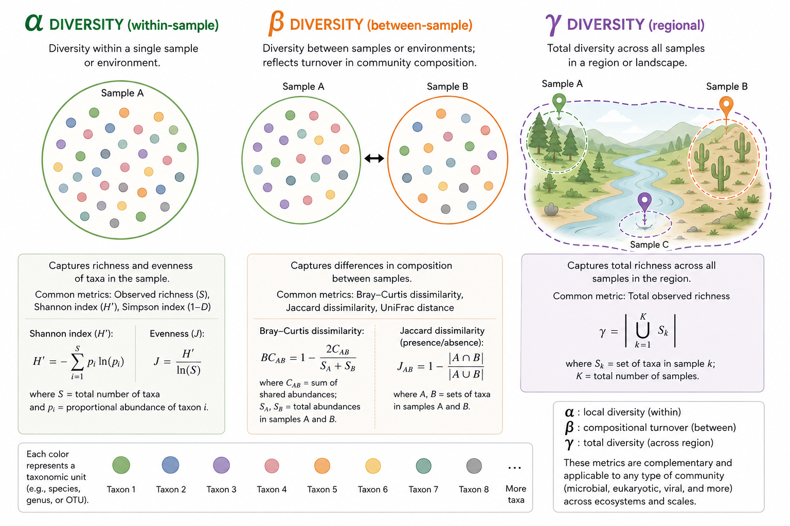
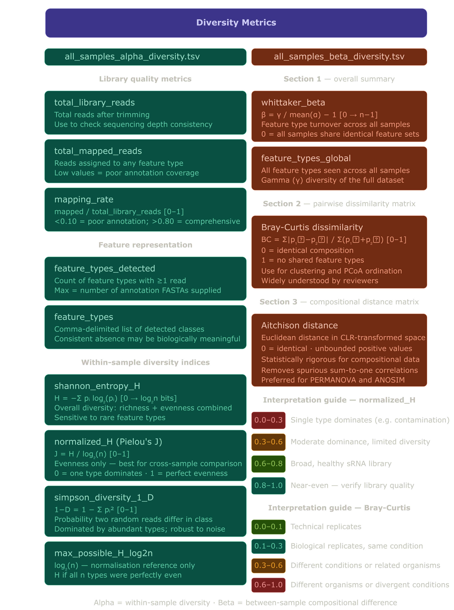

# exRNA-NF

A Nextflow DSL2 pipeline for quality control, alignment, annotation, and diversity quantification of small RNA (sRNA) sequencing libraries across any number of genomes.

---

## Table of contents

- [Overview](#overview)
- [Pipeline summary](#pipeline-summary)
- [Requirements](#requirements)
- [Installation](#installation)
- [Repository structure](#repository-structure)
- [Input data organization](#input-data-organization)
- [Parameters](#parameters)
- [Running the pipeline](#running-the-pipeline)
- [Output structure](#output-structure)
- [Diversity metrics](#diversity-metrics)
- [Troubleshooting](#troubleshooting)
- [Citation](#citation)

---

## Overview

exRNA-NF processes single-end small RNA sequencing data from extracellular fractions across multiple species in a single run. The pipeline performs adapter trimming, genome alignment, size distribution profiling, competitive alignment to a combined per-organism annotation index, and fractional feature-type quantification with alpha and beta diversity reporting.

The pipeline is designed using **competitive alignment**. All sRNA feature FASTAs for a given organism (miRNA, hairpin, cDNA, tRNA, rRNA, etc.) are merged into a single labeled index before alignment. This allows read alignments to compete across all feature types simultaneously, producing unbiased fractional counts for meaningful diversity estimates.


<p align="center">
  
</p>

---

## Pipeline summary

```
Raw FASTQ reads
      │
      ├── FastQC  →  MultiQC (aggregate QC report)
      │
      └── Trim Galore (adapter removal, length filter 10–50 nt)
                │
                ├── Genome alignment (bowtie2)
                │       └── Read size distribution (counts + RPM)
                │
                └── Annotation alignment
                        │
                        ├── tRNAscan-SE  (tRNA annotation)
                        ├── barrnap      (rRNA annotation)
                        └── portAnnotations ( Annotation FASTAs provided with the primary assembly)
                                │
                                └── BUILD_COMBINED_ANNOT_INDEX
                                    (label + merge feature FASTAs per organism,
                                     bowtie2-build combined index)
                                        │
                                        └── ALIGN_TO_COMBINED_ANNOTATIONS
                                            (bowtie2 competitive alignment, -k 10)
                                                │
                                                └── QUANTIFY_SRNA_DIVERSITY
                                                    (fractional counts, RPM,
                                                     Shannon H, Simpson 1-D,
                                                     Pielou J, mapping rate)
                                                        │
                                                        └── MERGE_DIVERSITY_OUTPUTS
                                                            (alpha + beta diversity,
                                                             Bray-Curtis, Aitchison,
                                                             Whittaker beta)
```

---

## Requirements

This pipeline uses minimal dependencies to maximize portability and speed of deployment.

### Software dependencies

| Tool | Version tested | Purpose |
|---|---|---|
| Nextflow | ≥ 23.04 | Workflow orchestration |
| bowtie2 | ≥ 2.5 | Genome and annotation alignment |
| Trim Galore | ≥ 0.6 | Adapter trimming |
| FastQC | ≥ 0.12 | Per-read quality control |
| MultiQC | ≥ 1.14 | Aggregate QC reporting |
| tRNAscan-SE | ≥ 2.0 | tRNA annotation |
| barrnap | ≥ 0.9 | rRNA annotation |
| samtools | ≥ 1.17 | BAM processing and indexing |
| Python | ≥ 3.10 | Quantification and diversity scripts |
| pysam | ≥ 0.21 | BAM file parsing in Python |

### Python packages

```
pysam
```

All other Python dependencies use standard library functions (`csv`, `math`, `collections`, `argparse`, `itertools`).

### System allocations

- **RAM**: 24–48 GB recommended (48 GB required for reasonably large genomes such as *Lactuca sativa*)
- **CPU**: >=8 cores recommended; processes are configured to use up to 8 threads
- **Storage**: ~50 GB per organism for genome indices; allocate 2–5× the size of your raw data for intermediate files

---

## Installation

### 1. Clone the repository

```bash
git clone https://github.com/5c077/exRNA-NF.git
cd exRNA-NF
```

### 2. Install Nextflow

```bash
curl -s https://get.nextflow.io | bash
mv nextflow ~/bin/   # or any directory on your $PATH
nextflow self-update
```

### 3. Install dependencies

Using conda (recommended for local):

```bash
conda env create -f environment.yml
conda activate exRNA-nf
```

Or using mamba client for a faster resolve:

```bash
mamba env create -f environment.yml
mamba activate exRNA-nf
```

### 4. Verify installation

```bash
nextflow run main_sRNA.nf --help
```
## Deployment

The pipeline can be run directly on a host system with all dependencies installed
(see [Requirements](#requirements) and [Installation](#installation)), or inside
a self-contained Docker container that bundles all dependencies into a portable
image. Docker is recommended for cluster environments and to guarantee reproducibility in deployments accross different systems.

### Building the Docker image

A `Dockerfile` is provided in the repository root. Build the image from the
repository directory:
```bash
docker build -t exRNA-nf:1.0.0 .
```

The image installs all dependencies defined in `environment.yml` at build time. Build time should be ~10–20
minutes with the first run.

### Running the pipeline in a container

Input data and output directories on the host machine are mounted into the
container at runtime using `-v`. The pipeline reads and writes through these
mount points such that all results appear as expected on the host filesystem:
```bash
DATA_DIR=/path/to/project_root

docker run --rm \
    -v ${DATA_DIR}/input:pipeline/input \
    -v ${DATA_DIR}/genome:/pipeline/genome \
    -v ${DATA_DIR}/results:/pipeline/results \
    -v ${DATA_DIR}/work:/pipeline/work \
    --cpus 36 \
    --memory 128g \
    exRNA-nf:latest \
    nextflow run main_sRNA.nf \
        -c nextflow.config \
        -resume
```
---

## Repository structure

```
exRNA-NF/
├── main_sRNA.nf                  # Main workflow entry point
├── nextflow.config               # Pipeline parameters and resource configs
├── environment.yml               # Conda environment specification
├── README.md                     # This file
├── .gitignore                    # Excluded files (see below)
│
├── modules/                      # DSL2 process modules
│   ├── build_combined_annot_index.nf
│   ├── align_to_combined_annotations.nf
│   ├── quantify_srna_diversity.nf
│   └── merge_diversity_outputs.nf
│
└── bin/                          # Python scripts (automatically added to $PATH by Nextflow)
    ├── quantify_srna_diversity.py
    ├── merge_diversity_outputs.py
    └── compare_fasta.py
```

> **Note:** Input data and output directories (`results/`, `work/`) are not stored in the repository. See [Input data organization](#input-data-organization) for the expected directory layout.

---

## Input data organization

The pipeline expects the following directory layout **alongside** the cloned repository.

```
project_root/
├── exRNA-NF/                          # cloned repository
│   └── main_sRNA.nf
│
├── exRNA_Species/                     # raw HTS input data
│   ├── exRNA_Hsa_sRNA/                 
│   │   ├── *.fastq.gz
│   │   └── ...
│   ├── exRNA_Mmu_sRNA/                
│   │   ├── *.fastq.gz
│   │   └── ...
│   └── exRNA_Gga_sRNA/                
│       ├── *.fastq.gz
│       └── ...
│
└── genome/                            # reference genomes and annotation FASTAs
    ├── Hsa_GRCh38/
    │   ├── Hsa_GRCh38_genome.fa
    │   ├── Hsa_GRCh38_miRNA.fa
    │   ├── Hsa_GRCh38_hairpin.fa
    │   ├── Hsa_GRCh38_TE.fa
    │   └── Hsa_GRCh38_cDNA.fa
    ├── Mmu_GRCm39/
    │   ├── Mmu_GRCm39_genome.fa
    │   ├── Mmu_GRCm39_miRNA.fa
    │   ├── Mmu_GRCm39_hairpin.fa
    │   ├── Mmu_GRCm39_TE.fa
    │   └── Mmu_GRCm39_cDNA.fa
    └── Gga_GRCg7b/
        ├── Gga_GRCg7b_genome.fa
        ├── Gga_GRCg7b_miRNA.fa
        ├── Gga_GRCg7b_hairpin.fa
        ├── Gga_GRCg7b_TE.fa
        └── Gga_GRCg7b_cDNA.fa
```

### Naming convention

Library FASTQ files need to follow the pattern `<OrganismPrefix>_<...>.fastq.gz` where `<OrganismPrefix>` is the first `_`-delimited token and should match the start of the corresponding genome directory name. For example:

| FASTQ prefix | Matches genome directory |
|---|---|
| `Col0_` | `Col0_Ath_TAIR10/` ( Col0 → genome name starts with organism code) |
| `Gma_` | `Gma_Wm82v4/` |
| `Zma_` | `Zma_B73v5/` |

> The matching logic in `main_sRNA.nf` uses `sample_id.startsWith(libPrefix)` — ensure prefixes are consistent between library filenames and genome directory names.

### Annotation FASTAs

Pre-computed annotation FASTAs (`*_miRNA.fa`, `*_hairpin.fa`, `*_TAS.fa`, `*_TE.fa`, `*_cDNA.fa`) should be placed in the genome directory alongside the genome FASTA. The tRNA and rRNA FASTAs are generated automatically by the pipeline using tRNAscan-SE and barrnap respectively.

Feature type labels in the combined index are derived directly from FASTA filenames by stripping the organism prefix and `.fa` suffix:

```
Col0_TAIR10_miRNA.fa  →  feature label: miRNA
Col0_TAIR10_tRNA.fa   →  feature label: tRNA
Col0_TAIR10_TE.fa     →  feature label: TE
```

---

## Parameters

All parameters are defined in `nextflow.config` and can be overridden at the command line with `--parameter value`.

| Parameter | Default | Description |
|---|---|---|
| `reads` | `exRNA_Species/*_sRNA/*fastq.gz` | Glob pattern for input FASTQ files |
| `genomes` | `genome/*/*_genome.fa` | Glob pattern for reference genome FASTAs |
| `genomes_dirs` | `genome/*` | Glob pattern for genome directories |
| `outdir` | `results/` | Output directory |
| `min_length` | `10` | Minimum read length after trimming (nt) |
| `max_length` | `50` | Maximum read length after trimming (nt) |
| `mismatches` | `0` | Mismatches allowed in annotation alignment |
| `max_feature_types` | `10` | Max alignments reported per read by bowtie2 (`-k`); should exceed number of feature types |
| `w_seg` | `null` | Comma-separated segment tokens for per-group Whittaker beta (see below) |
| `exclude_prefix` | `null` | Comma-separated library name prefixes to exclude from analysis |

### `--w_seg` — segmented Whittaker beta diversity

Calculates Whittaker beta diversity separately for subsets of samples defined by strings in their library names. Pipe-separated values within a token are treated as aliases for the same group.

```bash
# Calculate Whittaker beta striated by tissue or sample origin
> nextflow run main_sRNA.nf --w_seg "AWF,CL,LSW|LSF"
```
> **Note:** Assumes this information is present in, and consistent accross file names. The pipe operator can be used to group synonymous or biologically relevant samples in the same segmentation. Make sure that such a grouping is grounded in the your biological question!

Output in `all_samples_beta_diversity.tsv`:

```
whittaker_beta_global     0.2168    93
whittaker_beta_AWF        0.1832    31
whittaker_beta_CL         0.1544    28
whittaker_beta_LSW|LSF    0.2011    34
```

### `--exclude_prefix` — exclude sample libraries

Excludes libraries whose filenames start with any of the specified prefixes. Useful for excluding organisms from analysis without modifying the glob expression in configuration.

```bash
nextflow run main_sRNA.nf --exclude_prefix "Aco"
```

---

## Running the pipeline

### Basic run

```bash
cd /path/to/project_root
nextflow run Ex-sRNA-NF/main_sRNA.nf \
    -c Ex-sRNA-NF/nextflow.config
```

### Resume after failure or interruption

```bash
nextflow run Ex-sRNA-NF/main_sRNA.nf \
    -c Ex-sRNA-NF/nextflow.config \
    -resume
```

### Full run with all options

```bash
nextflow run Ex-sRNA-NF/main_sRNA.nf \
    -c Ex-sRNA-NF/nextflow.config \
    -with-dag dag.mmd \
    -with-trace \
    -with-report execution_report.html \
    --w_seg "AWF,CL,LSW|LSF" \
    --exclude_prefix "Aco" \
    -resume
```

### SLURM cluster

Modify for the institution profile in `nextflow.config`:

```nextflow
profiles {
    slurm {
        process.executor       = 'slurm'
        process.clusterOptions = '--account=<your_account>'
    }
}
```

Then run with:

```bash
nextflow run Ex-sRNA-NF/main_sRNA.nf \
    -c Ex-sRNA-NF/nextflow.config \
    -profile slurm \
    -resume
```

### Cleaning up work directories

After a successful run, remove intermediate files to recover disk space while preserving the most recent cached results:

```bash
nextflow clean -keep-last -f
```

To remove all work directories entirely:

```bash
rm -rf work/ .nextflow/ .nextflow.log
```

---

## Output structure

```
results/
├── 00_fastqc/                    # Per-library FastQC reports
├── 01_multiqc/                   # Aggregate MultiQC report
│   ├── multiqc_report.html
│   └── multiqc_data/
├── 02_trimGalore/                # Trimmed reads and trimming reports
├── 03_alignment/                 # Genome-aligned BAMs and alignment stats
├── 04_size_distribution/         # Read length distributions
│   ├── all_samples_size_distribution_counts.csv
│   └── all_samples_size_distribution_rpm.csv
├── 05_annotation_alignment/
│   └── combined/                 # BAMs aligned to combined annotation index
├── 06_srna_diversity/
│   ├── all_samples_srna_diversity.tsv      # Per-sample per-feature counts and RPM
│   ├── all_samples_alpha_diversity.tsv     # Per-sample alpha diversity metrics
│   └── all_samples_beta_diversity.tsv      # Pairwise beta diversity matrices
├── annotation_indices/
│   └── combined/                 # Combined per-organism bowtie2 indices
└── annotations/
    ├── tRNA/                     # tRNAscan-SE outputs per organism
    └── rRNA/                     # barrnap outputs per organism
```

### Key output files

**`all_samples_srna_diversity.tsv`**

Per-sample per-feature fractional counts and RPM. One row per sample-feature combination.

| Column | Description |
|---|---|
| `sample_id` | Library name |
| `feature_type` | sRNA feature class (miRNA, tRNA, rRNA, TAS, TE, cDNA, hairpin) |
| `fractional_count` | Read count after fractional assignment across feature types |
| `unique_feature_count` | Reads mapping exclusively to this feature type |
| `shared_feature_count` | Reads shared fractionally with other feature types |
| `RPM` | Reads per million (denominator = total library reads) |
| `fraction` | Proportion of mapped reads assigned to this feature type |
| `percent` | `fraction × 100` |

**`all_samples_alpha_diversity.tsv`**

One row per sample. Contains library quality metrics and within-sample diversity indices.

| Column | Description |
|---|---|
| `total_library_reads` | Total reads after trimming (from bowtie2 stats) |
| `total_mapped_reads` | Reads mapping to any annotated feature type |
| `mapping_rate` | `total_mapped / total_library` |
| `feature_types_detected` | Number of feature types with ≥1 assigned read |
| `feature_types` | Comma-delimited list of detected feature types |
| `shannon_entropy_H` | Shannon entropy in bits |
| `max_possible_H_log2n` | Maximum possible H given detected feature types |
| `normalized_H` | Pielou's evenness J = H / log2(n); comparable across samples |
| `simpson_diversity_1_D` | Simpson's diversity index |

**`all_samples_beta_diversity.tsv`**

Three-section file containing Whittaker summary, Bray-Curtis dissimilarity matrix, and Aitchison distance matrix across all samples.

---

## Diversity metrics

<p align="center">
  
</p>

### Alpha diversity (within-sample)

| Metric | Formula | Range | Best for |
|---|---|---|---|
| Shannon H | −Σ pᵢ log₂(pᵢ) | 0 → log₂(n) | Overall diversity, sensitive to rare types |
| Normalized H (Pielou J) | H / log₂(n) | 0–1 | Cross-sample evenness comparison |
| Simpson 1-D | 1 − Σ pᵢ² | 0–1 | Dominance probability, robust to rare types |

Normalized H interpretation guide:

| Range | Interpretation |
|---|---|
| 0.0–0.3 | Single feature type strongly dominates (e.g. contamination) |
| 0.3–0.6 | Moderate dominance, limited diversity |
| 0.6–0.8 | Broad, healthy sRNA library — typical of good quality data |
| 0.8–1.0 | Near-even distribution — verify library preparation quality |

### Beta diversity (between-samples)

| Metric | Formula | Range | Best for |
|---|---|---|---|
| Whittaker beta | γ / mean(α) − 1 | 0 → n−1 | Feature type turnover across all samples |
| Bray-Curtis | Σ\|p₁ₖ−p₂ₖ\| / Σ(p₁ₖ+p₂ₖ) | 0–1 | Ordination, clustering, widely understood |
| Aitchison | Euclidean in CLR space | 0 → ∞ | Statistically rigorous for compositional data |

NOTE: The **Aitchison distance** is great for PERMANOVA and ordination, while **Bray-Curtis**  is supplementary for downstream visualization.

---

### Reference database sources

**tRNA — GtRNAdb** (Lowe Lab, UCSC): https://gtrnadb.ucsc.edu

```bash
# Download Arabidopsis tRNA FASTA
wget https://gtrnadb.ucsc.edu/genomes/eukaryota/Athal10/arabidopsis_thaliana-tRNAs.fa
```

**rRNA — SILVA 138.2**: https://www.arb-silva.de/download/arb-files/

```bash
wget https://www.arb-silva.de/fileadmin/silva_databases/release_138_2/Exports/SILVA_138.2_SSURef_NR99_tax_silva.fasta.gz
```

---

## Troubleshooting

### Common issues

**`unknown` feature types in diversity output**

Caused by a mismatch between FASTA headers and BAM reference names. FASTA headers containing whitespace are truncated by bowtie2 at the first space when written to the BAM. Ensure `build_combined_annot_index.nf` has run fresh (not from cache) after any annotation changes, and that stale `QUANTIFY_SRNA_DIVERSITY` and `MERGE_DIVERSITY_OUTPUTS` work directories have been cleared.

```bash
find work/ -name "*_srna_diversity.tsv" | grep -v "all_samples" | \
    xargs -I{} dirname {} | sort -u | xargs rm -rf
find work/ -name "all_samples_*.tsv" | \
    xargs -I{} dirname {} | sort -u | xargs rm -rf
```

**`genome_rRNA` or `genome_tRNA` feature labels**

Caused by an inconsistency in `sample_id` stripping between `annotate_tRNA`/`annotate_rRNA` (which emit `sample_id` with `_genome` suffix) and `portAnnotations` (which strips it). Clear the `BUILD_COMBINED_ANNOT_INDEX` cache:

```bash
find work/ -name "*_bowtie_build.log" | \
    xargs -I{} dirname {} | sort -u | xargs rm -rf
```

**`samtools sort: failed to read header from "-"`**

bowtie2 produced no output. The usual cause is the index was not staged correctly into the `ALIGN_TO_COMBINED_ANNOTATIONS` work directory. Check that the `index/` subdirectory is populated:

```bash
find work/ -name "*_bowtie2_stats.txt" | head -1 | \
    xargs dirname | xargs -I{} ls -la {}/index/
```

**`^M` characters in output files**

Windows-style line endings in input or output files. Fixed by the `.strip()` calls in `merge_diversity_outputs.py`. If they persist, convert files manually:

```bash
sed -i 's/\r//' results/06_srna_diversity/all_samples_*.tsv
```

**Pipeline cached incorrectly after code changes**

If a process uses a script from `bin/` that was modified after the process last ran, Nextflow will not automatically detect the change and may use cached results. Clear the relevant process work directories manually before rerunning with `-resume`.

**Large genome index build failure (Lsa)**

Reasonably large genomes (~2.7 Gb) may exceed standard bowtie2 index limits. The pipeline automatically retries with `--large-index`. If this fails, check available disk space (large indices require ~20 GB) and RAM (≥48 GB required).

### Verifying combined FASTA labels before a full run

After `BUILD_COMBINED_ANNOT_INDEX` completes, verify feature labels are correct before the alignment step proceeds:

```bash
find work/ -name "*_bowtie_build.log" | \
    while read log; do
        dir=$(dirname $log)
        fa=$(ls $dir/*_combined.fa 2>/dev/null | head -1)
        if [ -n "$fa" ]; then
            echo "=== $(basename $fa) ==="
            grep "^>" $fa | awk -F'|' '{print $1}' | sort -u
        fi
    done
```

Expected output for each organism:

```
>cDNA
>hairpin
>miRNA
>rRNA
>TE
>tRNA
>...

```

---

## Citation

**If you use this pipeline, please cite this repository!**

Please also cite the underlying tools:

- **Nextflow**: Di Tommaso *et al.* (2017) *Nature Biotechnology* 35:316–319
- **bowtie2**: Langmead & Salzberg (2012) *Nature Methods* 9:357–359
- **Trim Galore**: https://github.com/FelixKrueger/TrimGalore
- **tRNAscan-SE**: Chan *et al.* (2021) *Nucleic Acids Research* 49:D366–D374
- **barrnap**: https://github.com/tseemann/barrnap
- **samtools**: Danecek *et al.* (2021) *GigaScience* 10:giab008

---

## Author

Scott Lewis

For questions or bug reports, please open an issue on GitHub.
