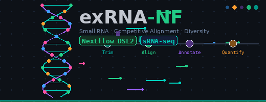
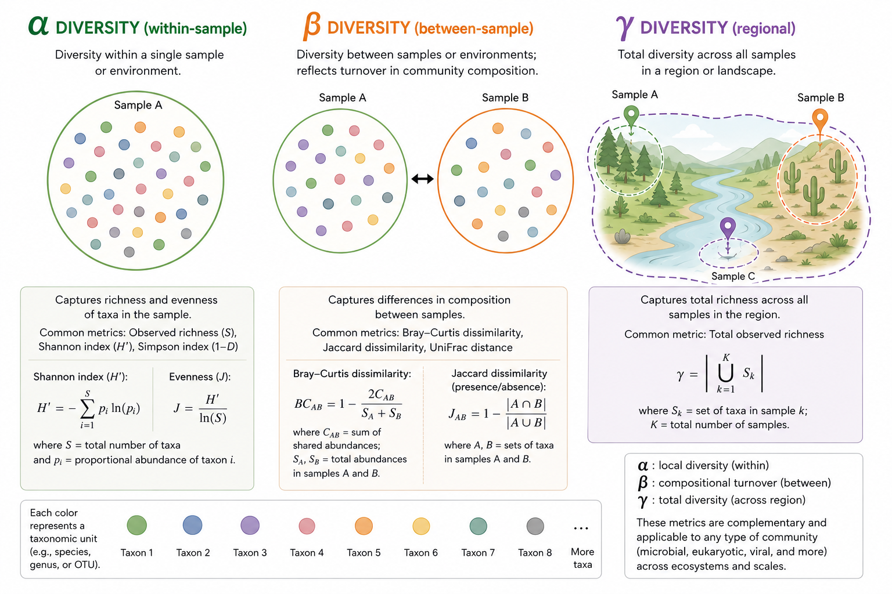
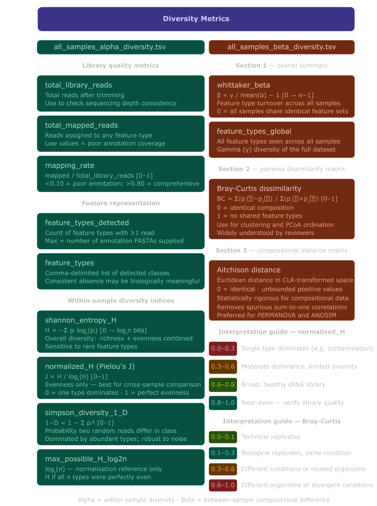

## Table of contents

- [Overview](#overview)
- [Pipeline summary](#pipeline-summary)
- [Requirements](#requirements)
- [Installation](#installation)
- [Deployment](#deployment)
- [Repository structure](#repository-structure)
- [Input data organization](#input-data-organization)
- [Parameters](#parameters)
- [Running the pipeline](#running-the-pipeline)
- [Output structure](#output-structure)
- [Diversity metrics](#diversity-metrics)
- [Troubleshooting](#troubleshooting)
- [Citation](#citation)

---

## Overview

exRNA-NF processes single-end small RNA sequencing data from extracellular fractions across multiple species in a single run. The pipeline performs adapter trimming, genome alignment, size distribution profiling, competitive alignment to a combined per-organism annotation index, fractional feature-type quantification with alpha and beta diversity reporting, and per-feature-name abundance counting with tRNA size-class stratification.

The pipeline is designed using **competitive alignment**. All sRNA feature FASTAs for a given organism (miRNA, hairpin, tRNA, rRNA, TAS, TE, 5UTR, CDS, 3UTR, lncRNA, snoRNA, snRNA, etc.) are merged into a single labeled index before alignment. This allows read alignments to compete across all feature types simultaneously, producing unbiased fractional counts for meaningful diversity estimates.

<p align="center">
  
</p>

---

## Pipeline summary

```
Raw FASTQ reads
      │
      ├── FastQC  →  MultiQC (aggregate QC report)
      │
      └── Trim Galore (adapter removal, length filter 10–50 nt)
                │
                ├── Genome alignment (bowtie2)
                │       └── extractSizeDistribution
                │           (total + per-feature read length distributions,
                │            stratified by genome, tissue, and feature type)
                │               └── mergeSizeDistributions
                │                   (all_samples_size_distribution_counts.csv
                │                    all_samples_size_distribution_rpm.csv)
                │
                └── Annotation alignment
                        │
                        ├── tRNAscan-SE  (tRNA annotation)
                        ├── barrnap      (rRNA annotation)
                        └── portAnnotations
                            (annotation FASTAs provided with primary assembly:
                             miRNA, hairpin, TAS, TE, 5UTR, CDS, 3UTR,
                             lncRNA, snoRNA, snRNA)
                                │
                                └── BUILD_COMBINED_ANNOT_INDEX
                                    (label + merge feature FASTAs per organism,
                                     bowtie2-build combined index)
                                        │
                                        └── ALIGN_TO_COMBINED_ANNOTATIONS
                                            (bowtie2 competitive alignment, -k 10)
                                                │
                                                ├── QUANTIFY_SRNA_DIVERSITY
                                                │   (fractional counts, RPM,
                                                │    Shannon H, Simpson 1-D,
                                                │    Pielou J, mapping rate,
                                                │    Other category)
                                                │       └── MERGE_DIVERSITY_OUTPUTS
                                                │           (alpha + beta diversity,
                                                │            Bray-Curtis, Aitchison,
                                                │            Whittaker beta)
                                                │
                                                └── COUNT_SRNA_FEATURES
                                                    (per-feature-name fractional
                                                     counts and RPM; tRNA split
                                                     into tRNA_all, tRNA_tRF,
                                                     tRNA_tiRNA size classes)
                                                        └── MERGE_SRNA_FEATURE_COUNTS
                                                            (all_samples_feature_counts.tsv)
```

---

## Requirements

### Software dependencies

| Tool | Version tested | Purpose |
|---|---|---|
| Nextflow | ≥ 23.04 | Workflow orchestration |
| bowtie2 | ≥ 2.5 | Genome and annotation alignment |
| Trim Galore | ≥ 0.6 | Adapter trimming |
| FastQC | ≥ 0.12 | Per-read quality control |
| MultiQC | ≥ 1.14 | Aggregate QC reporting |
| tRNAscan-SE | ≥ 2.0 | tRNA annotation |
| barrnap | ≥ 0.9 | rRNA annotation |
| samtools | ≥ 1.17 | BAM processing, indexing, and name-sorting |
| Python | ≥ 3.10 | Quantification and diversity scripts |
| pysam | ≥ 0.21 | BAM file parsing in Python |

### Python packages

```
pysam
```

All other Python dependencies use standard library modules (`csv`, `math`, `re`, `collections`, `argparse`, `subprocess`, `os`).

### System requirements

- **RAM**: 24–48 GB recommended per concurrent process. The `extractSizeDistribution` and `COUNT_SRNA_FEATURES` processes each require up to 24 GB for large libraries. Genome index building for *Lactuca sativa* requires ≥ 48 GB.
- **CPU**: ≥ 8 cores recommended. Processes are configured to use up to 4–8 threads each. Concurrent job limits (`maxForks`) are set in `nextflow.config` to keep total memory within available system RAM.
- **Storage**: ~50 GB per organism for genome indices; allocate 2–5× the size of your raw data for intermediate files in `work/`.

---

## Installation

### 1. Clone the repository

```bash
git clone https://github.com/5c077/exRNA-NF.git
cd exRNA-NF
```

### 2. Install Nextflow

```bash
curl -s https://get.nextflow.io | bash
mv nextflow ~/bin/   # or any directory on your $PATH
nextflow self-update
```

### 3. Install dependencies

Using conda (recommended):

```bash
conda env create -f environment.yml
conda activate exRNA-nf
```

Or using mamba for a faster resolve:

```bash
mamba env create -f environment.yml
mamba activate exRNA-nf
```

### 4. Verify installation

```bash
nextflow run main_sRNA.nf --help
```

---

## Deployment

The pipeline can be run directly on a host system with all dependencies installed (see [Requirements](#requirements) and [Installation](#installation)), or inside a self-contained Docker container that bundles all dependencies into a portable image. Docker is recommended for cluster environments and to guarantee reproducibility across different systems.

### Building the Docker image

A `Dockerfile` is provided in the repository root. Build the image from the repository directory:

```bash
docker build -t exRNA-nf:1.0.0 .
```

The image installs all dependencies defined in `environment.yml` at build time. Build time is approximately 10–20 minutes on the first run.

### Running the pipeline in a container

Input data and output directories on the host machine are mounted into the container at runtime using `-v`. The pipeline reads and writes through these mount points such that all results appear as expected on the host filesystem:

```bash
DATA_DIR=/path/to/project_root

docker run --rm \
    -v ${DATA_DIR}/input:/pipeline/input \
    -v ${DATA_DIR}/genome:/pipeline/genome \
    -v ${DATA_DIR}/results:/pipeline/results \
    -v ${DATA_DIR}/work:/pipeline/work \
    --cpus 36 \
    --memory 128g \
    exRNA-nf:latest \
    nextflow run main_sRNA.nf \
        -c nextflow.config \
        -resume
```

---

## Repository structure

```
exRNA-NF/
├── main_sRNA.nf                        # Main workflow entry point
├── nextflow.config                     # Pipeline parameters and resource configs
├── environment.yml                     # Conda environment specification
├── Dockerfile                          # Container image definition
├── .dockerignore                       # Files excluded from Docker build context
├── README.md                           # This file
├── .gitignore                          # Files excluded from version control
│
├── modules/                            # DSL2 process modules
│   ├── fastqc.nf
│   ├── multiqc.nf
│   ├── trimGalore.nf
│   ├── buildIndex.nf
│   ├── align_sRNA.nf
│   ├── annotate_tRNA.nf
│   ├── annotate_rRNA.nf
│   ├── portAnnotations.nf
│   ├── build_combined_annot_index.nf
│   ├── align_to_combined_annotations.nf
│   ├── quantify_srna_diversity.nf
│   ├── merge_diversity_outputs.nf
│   ├── compute_beta_diversity.nf
│   ├── extractSizeDistribution.nf
│   ├── mergeSizeDistributions.nf
│   ├── count_srna_features.nf
│   └── merge_srna_feature_counts.nf
│
└── bin/                                # Python scripts (on $PATH during pipeline execution)
    ├── quantify_srna_diversity.py      # Fractional counting, RPM, alpha diversity
    ├── merge_diversity_outputs.py      # Alpha + beta diversity merge
    ├── count_srna_features.py          # Per-feature-name fractional counts
    ├── dedup_fasta.py                  # FASTA deduplication by header
    └── compare_fasta.py                # FASTA comparison utility
```

> **Note:** Input data and output directories (`exRNA_Species/`, `genome/`, `results/`, `work/`) are not stored in the repository. See [Input data organization](#input-data-organization) for the expected directory layout.

---

## Input data organization

The pipeline expects the following directory layout **alongside** the cloned repository.

```
project_root/
├── exRNA-NF/                          # cloned repository
│   └── main_sRNA.nf
│
├── exRNA_Species/                     # raw HTS input data
│   ├── exRNA_Hsa_sRNA/
│   │   ├── *.fastq.gz
│   │   └── ...
│   ├── exRNA_Mmu_sRNA/
│   │   ├── *.fastq.gz
│   │   └── ...
│   └── exRNA_Gga_sRNA/
│       ├── *.fastq.gz
│       └── ...
│
└── genome/                            # reference genomes and annotation FASTAs
    ├── Hsa_GRCh38/
    │   ├── Hsa_GRCh38_genome.fa
    │   ├── Hsa_GRCh38_miRNA.fa       # miRNA + hairpin pooled into one file
    │   ├── Hsa_GRCh38_TAS.fa
    │   ├── Hsa_GRCh38_TE.fa
    │   ├── Hsa_GRCh38_5UTR.fa
    │   ├── Hsa_GRCh38_CDS.fa
    │   ├── Hsa_GRCh38_3UTR.fa
    │   ├── Hsa_GRCh38_lncRNA.fa
    │   ├── Hsa_GRCh38_snoRNA.fa
    │   └── Hsa_GRCh38_snRNA.fa
    ├── Mmu_GRCm39/
    │   └── ...
    └── Gga_GRCg7b/
        └── ...
```

### Naming convention

Library FASTQ files must follow the pattern `<OrganismPrefix>_<...>.fastq.gz` where `<OrganismPrefix>` is the first `_`-delimited token and matches the start of the corresponding genome directory name:

| FASTQ prefix | Matches genome directory |
|---|---|
| `Hsa_` | `Hsa_GRCh38/` |
| `Mmu_` | `Mmu_GRCm39/` |
| `Gga_` | `Gga_GRCg7b/` |

The matching logic in `main_sRNA.nf` uses `sample_id.startsWith(libPrefix)` — ensure prefixes are consistent between library filenames and genome directory names.

### Treatment tokens

The pipeline parses tissue or sample-type information from the library name for stratification in size distribution and feature count outputs. Recognized treatment tokens are `AWF`, `CL`, `LSW`, and `LSF`. These must appear as whole underscore-delimited fields in the library filename:

```
Hsa_Patient1_AWF_R1_S01_R1_001.fastq.gz   →  tissue: AWF
Hsa_Patient1_CL_R2_S02_R1_001.fastq.gz    →  tissue: CL
```

### Annotation FASTAs

Pre-computed annotation FASTAs should be placed in the genome directory alongside the genome FASTA. tRNA and rRNA FASTAs are generated automatically by the pipeline using tRNAscan-SE and barrnap respectively. All other annotation FASTAs must be provided by the user.

**Important notes on annotation FASTA preparation:**

miRNA and hairpin FASTAs should be **pooled into a single file** before placing in the genome directory. Keeping them separate causes systematic 0.5/0.5 fractional splitting because mature miRNA sequences are subsequences of their precursor hairpins.

```bash
cat Hsa_GRCh38_miRNA.fa Hsa_GRCh38_hairpin.fa > Hsa_GRCh38_miRNA.fa
```

All annotation FASTAs should be deduplicated before use to avoid inflating alignment counts from redundant coordinate entries in the source GFF3:

```bash
python3 bin/dedup_fasta.py \
    --input  Hsa_GRCh38_snoRNA.fa \
    --out    Hsa_GRCh38_snoRNA_dedup.fa \
    --ignore_suffix \
    --report Hsa_GRCh38_snoRNA_dedup_report.tsv
```

Feature type labels in the combined index are derived automatically from FASTA filenames by stripping the organism prefix and `.fa` suffix:

```
Hsa_GRCh38_miRNA.fa   →  feature label: miRNA
Hsa_GRCh38_tRNA.fa    →  feature label: tRNA   (generated by tRNAscan-SE)
Hsa_GRCh38_5UTR.fa    →  feature label: 5UTR
Hsa_GRCh38_snoRNA.fa  →  feature label: snoRNA
```

Any FASTA file placed in the genome directory matching the pattern `{prefix}_*.fa` will be picked up automatically by `portAnnotations` — no pipeline code changes are required when adding new feature types.

### Annotation database sources

| Feature | Primary source |
|---|---|
| miRNA / hairpin | miRBase (https://www.mirbase.org) |
| tRNA | Generated by tRNAscan-SE from genome FASTA |
| rRNA | Generated by barrnap from genome FASTA |
| 5UTR / CDS / 3UTR / lncRNA / snoRNA / snRNA | Ensembl Plants GFF3 → bedtools getfasta |
| TAS / TE | Organism-specific databases (PhasiRNA DB, RepBase) |

---

## Parameters

All parameters are defined in `nextflow.config` and can be overridden at the command line with `--parameter value`.

| Parameter | Default | Description |
|---|---|---|
| `reads` | `exRNA_Species/*_sRNA/*fastq.gz` | Glob pattern for input FASTQ files |
| `genomes` | `genome/*/*_genome.fa` | Glob pattern for reference genome FASTAs |
| `genomes_dirs` | `genome/*` | Glob pattern for genome directories |
| `outdir` | `results/` | Output directory |
| `min_length` | `10` | Minimum read length after trimming (nt) |
| `max_length` | `50` | Maximum read length after trimming (nt) |
| `mismatches` | `0` | Mismatches allowed in annotation alignment |
| `max_feature_types` | `10` | Max alignments reported per read by bowtie2 (`-k`); should exceed total number of feature types |
| `w_seg` | `null` | Comma-separated segment tokens for per-group Whittaker beta (see below) |
| `exclude_prefix` | `null` | Comma-separated library name prefixes to exclude from analysis |

### `--w_seg` — segmented Whittaker beta diversity

Calculates Whittaker beta diversity separately for subsets of samples defined by strings in their library names. Pipe-separated values within a token are treated as aliases for the same group.

```bash
nextflow run main_sRNA.nf --w_seg "AWF,CL,LSW|LSF"
```

> **Note:** Assumes this information is present in and consistent across file names. The pipe operator can be used to group synonymous or biologically equivalent samples. Ensure such a grouping is grounded in the biological question being asked.

Output in `all_samples_beta_diversity.tsv`:

```
whittaker_beta_global     0.2168    93
whittaker_beta_AWF        0.1832    31
whittaker_beta_CL         0.1544    28
whittaker_beta_LSW|LSF    0.2011    34
```

### `--exclude_prefix` — exclude libraries

Excludes libraries whose filenames start with any of the specified prefixes. Useful for excluding organisms without modifying the glob expression in configuration.

```bash
nextflow run main_sRNA.nf --exclude_prefix "Aco"
```

---

## Running the pipeline

### Basic run

```bash
cd /path/to/project_root
nextflow run exRNA-NF/main_sRNA.nf \
    -c exRNA-NF/nextflow.config
```

### Resume after failure or interruption

```bash
nextflow run exRNA-NF/main_sRNA.nf \
    -c exRNA-NF/nextflow.config \
    -resume
```

### Full run with all options

```bash
nextflow run exRNA-NF/main_sRNA.nf \
    -c exRNA-NF/nextflow.config \
    -with-dag dag.mmd \
    -with-trace \
    -with-report execution_report.html \
    --w_seg "AWF,CL,LSW|LSF" \
    --exclude_prefix "Aco" \
    -resume
```

### SLURM cluster

Modify the institution profile in `nextflow.config`:

```nextflow
profiles {
    slurm {
        process.executor       = 'slurm'
        process.clusterOptions = '--account=<your_account>'
    }
}
```

Then run with:

```bash
nextflow run exRNA-NF/main_sRNA.nf \
    -c exRNA-NF/nextflow.config \
    -profile slurm \
    -resume
```

### Cleaning up work directories

After a successful run, remove intermediate files to recover disk space while preserving the most recent cached results:

```bash
nextflow clean -keep-last -f
```

To remove all work directories entirely:

```bash
rm -rf work/ .nextflow/ .nextflow.log
```

---

## Output structure

```
results/
├── 00_fastqc/                         # Per-library FastQC reports
├── 01_multiqc/                        # Aggregate MultiQC report
│   ├── multiqc_report.html
│   └── multiqc_data/
├── 02_trimGalore/                     # Trimmed reads and trimming reports
├── 03_alignment/                      # Genome-aligned BAMs and alignment stats
├── 04_size_distribution/              # Read length distributions
│   ├── all_samples_size_distribution_counts.csv
│   └── all_samples_size_distribution_rpm.csv
├── 05_annotation_alignment/
│   └── combined/                      # BAMs aligned to combined annotation index
├── 06_srna_diversity/
│   ├── all_samples_srna_diversity.tsv
│   ├── all_samples_alpha_diversity.tsv
│   └── all_samples_beta_diversity.tsv
├── 07_feature_counts/                 # Per-feature-name abundance counts
│   └── all_samples_feature_counts.csv
├── annotation_indices/
│   └── combined/                      # Combined per-organism bowtie2 indices
└── annotations/
    ├── tRNA/                          # tRNAscan-SE outputs per organism
    ├── rRNA/                          # barrnap outputs per organism
    ├── miRNA/
    ├── TAS/
    ├── TE/
    ├── 5UTR/
    ├── CDS/
    ├── 3UTR/
    ├── lncRNA/
    ├── snoRNA/
    └── snRNA/
```

### Key output files

**`04_size_distribution/all_samples_size_distribution_rpm.csv`**

Read length distributions stratified by library, genome, tissue type, and feature type. Each row represents one library-feature combination across all size bins from 10 to 50 nt.

| Column | Description |
|---|---|
| `library` | Full library name |
| `genome` | Genome label parsed from alignment filename |
| `tissue` | Treatment token (AWF, CL, LSW, LSF) parsed from library name |
| `feature_type` | sRNA feature class, or `Total` / `Other` |
| `10` … `50` | RPM value for reads of that length (denominator = total library reads) |

Row order within each library: `Total` first, `Other` second, then all feature types alphabetically.

**`06_srna_diversity/all_samples_srna_diversity.tsv`**

Per-sample per-feature fractional counts and RPM. One row per sample-feature combination.

| Column | Description |
|---|---|
| `sample_id` | Library name |
| `feature_type` | sRNA feature class |
| `fractional_count` | Read count after fractional assignment across feature types |
| `unique_feature_count` | Reads mapping exclusively to this feature type |
| `shared_feature_count` | Reads shared fractionally with other feature types |
| `RPM` | Reads per million (denominator = total library reads) |
| `fraction` | Proportion of mapped reads assigned to this feature type |
| `percent` | `fraction × 100` |

The `Other` category captures genome-mapped reads that did not align to any annotated feature and is included in all alpha and beta diversity calculations.

**`06_srna_diversity/all_samples_alpha_diversity.tsv`**

One row per sample containing library quality metrics and within-sample diversity indices.

| Column | Description |
|---|---|
| `total_library_reads` | Total reads after trimming (from bowtie2 stats) |
| `total_mapped_reads` | Reads mapping to any annotated feature type |
| `mapping_rate` | `total_mapped / total_library` |
| `feature_types_detected` | Number of feature types with ≥ 1 assigned read |
| `feature_types` | Comma-delimited list of detected feature types |
| `shannon_entropy_H` | Shannon entropy in bits |
| `max_possible_H_log2n` | Maximum possible H given detected feature types |
| `normalized_H` | Pielou's evenness J = H / log₂(n) |
| `simpson_diversity_1_D` | Simpson's diversity index |

**`06_srna_diversity/all_samples_beta_diversity.tsv`**

Three-section file containing Whittaker summary statistics, Bray-Curtis dissimilarity matrix, and Aitchison distance matrix across all samples.

**`07_feature_counts/all_samples_feature_counts.tsv`**

Per-feature-name fractional counts and RPM across all libraries. One row per library × feature_type × feature_name combination. tRNA is expanded into three sub-categories based on read length, reflecting the distinct biogenesis of tRNA-derived fragments and tRNA halves.

| Column | Description |
|---|---|
| `library` | Library name |
| `genome` | Genome label |
| `tissue` | Treatment token (AWF, CL, LSW, LSF) |
| `feature_type` | Feature class (miRNA, tRNA_all, tRNA_tRF, tRNA_tiRNA, 5UTR, CDS, etc.) |
| `feature_name` | Individual sequence ID from the FASTA header (e.g. `ath-miR156a`, `ath-tRNA-Ala-AGC-1-1`) |
| `raw_count` | Fractional read count assigned to this sequence |
| `RPM` | Reads per million (denominator = total library reads) |

tRNA size-class definitions:

| Feature type | Size range | Biological class |
|---|---|---|
| `tRNA_all` | 10–50 nt | All tRNA-mapping reads |
| `tRNA_tRF` | 10–27 nt | tRNA-derived fragments (tRFs) |
| `tRNA_tiRNA` | 28–50 nt | tRNA halves / tiRNAs |

All three tRNA sub-category rows are always emitted for every tRNA sequence, even when the count is zero, ensuring a complete matrix structure for variance estimation and cross-library comparisons.

Example quick-filter in R:

```r
library(tidyverse)
df <- read_tsv("all_samples_feature_counts.tsv")

# Top 20 miRNAs by mean RPM across AWF samples
df |>
  filter(feature_type == "miRNA", tissue == "AWF") |>
  group_by(feature_name) |>
  summarise(mean_RPM = mean(RPM)) |>
  slice_max(mean_RPM, n = 20)
```

Example quick-filter in Python:

```python
import pandas as pd
df = pd.read_csv("all_samples_feature_counts.tsv", sep="\t")

# tRNA halves across all genomes
tirna = df[df["feature_type"] == "tRNA_tiRNA"]
tirna.groupby(["genome", "feature_name"])["RPM"].mean().sort_values(ascending=False)
```

---

## Diversity metrics

<p align="center">
  
</p>

### Alpha diversity (within-sample)

| Metric | Formula | Range | Best for |
|---|---|---|---|
| Shannon H | −Σ pᵢ log₂(pᵢ) | 0 → log₂(n) | Overall diversity, sensitive to rare types |
| Normalized H (Pielou J) | H / log₂(n) | 0–1 | Cross-sample evenness comparison |
| Simpson 1-D | 1 − Σ pᵢ² | 0–1 | Dominance probability, robust to rare types |

Normalized H interpretation guide:

| Range | Interpretation |
|---|---|
| 0.0–0.3 | Single feature type strongly dominates (e.g. contamination) |
| 0.3–0.6 | Moderate dominance, limited diversity |
| 0.6–0.8 | Broad, healthy sRNA library — typical of good quality data |
| 0.8–1.0 | Near-even distribution — verify library preparation quality |

### Beta diversity (between-samples)

| Metric | Formula | Range | Best for |
|---|---|---|---|
| Whittaker beta | γ / mean(α) − 1 | 0 → n−1 | Feature type turnover across all samples |
| Bray-Curtis | Σ\|p₁ₖ−p₂ₖ\| / Σ(p₁ₖ+p₂ₖ) | 0–1 | Ordination, clustering, widely understood |
| Aitchison | Euclidean in CLR space | 0 → ∞ | Statistically rigorous for compositional data |

The **Aitchison distance** is preferred for PERMANOVA and ordination. **Bray-Curtis** is supplementary for downstream visualization.

---

## Troubleshooting

### Common issues

**`unknown` feature types in diversity output**

Caused by a mismatch between FASTA headers and BAM reference names. FASTA headers containing whitespace are truncated by bowtie2 at the first space when written to the BAM. Ensure `BUILD_COMBINED_ANNOT_INDEX` has run fresh (not from cache) after any annotation changes, and that stale downstream work directories have been cleared.

```bash
find work/ -name "*_srna_diversity.tsv" | grep -v "all_samples" | \
    xargs -I{} dirname {} | sort -u | xargs rm -rf
find work/ -name "all_samples_*.tsv" | \
    xargs -I{} dirname {} | sort -u | xargs rm -rf
```

**`genome_rRNA` or `genome_tRNA` feature labels**

Caused by inconsistency in `sample_id` stripping between `annotate_tRNA`/`annotate_rRNA` (which emit `sample_id` with `_genome` suffix) and `portAnnotations` (which strips it). Clear the `BUILD_COMBINED_ANNOT_INDEX` cache:

```bash
find work/ -name "*_bowtie_build.log" | \
    xargs -I{} dirname {} | sort -u | xargs rm -rf
```

**OOM error (exit code 137) in `extractSizeDistribution` or `COUNT_SRNA_FEATURES`**

These processes read large BAM files and can exhaust memory when many jobs run concurrently. Reduce `maxForks` in `nextflow.config` for the affected processes, or increase the `memory` directive. `COUNT_SRNA_FEATURES` sorts the annotation BAM by query name using `samtools sort -n` to enable streaming — ensure sufficient temporary disk space is available in the work directory.

**`COUNT_SRNA_FEATURES` reports `Genome: unknown`**

The genome label is derived from the `combined_fa` filename (e.g. `Hsa_GRCh38_combined.fa` → `Hsa_GRCh38`) rather than from the library name, since the lib_name emitted by `alignToCombinedAnnotations` does not contain the `_vs_genome` suffix. If genome is showing as `unknown`, verify the `combined_fa` filename matches the expected pattern `{genome_label}_combined.fa`.

**`MERGE_SRNA_FEATURE_COUNTS` appears hung**

The merge process uses shell `cat` and `tail` for concatenation rather than Python CSV processing, which is necessary given the potentially hundreds of millions of rows across all libraries. If the process appears hung after more than 30 minutes, check available disk space — the merged output file for a large multi-species experiment can exceed 10 GB.

**`samtools sort: failed to read header from "-"`**

bowtie2 produced no output for a library-genome combination. Check that the index was staged correctly into the `ALIGN_TO_COMBINED_ANNOTATIONS` work directory:

```bash
find work/ -name "*_bowtie2_stats.txt" | head -1 | \
    xargs dirname | xargs -I{} ls -la {}/index/
```

**`^M` characters in output files**

Windows-style line endings in input or output files. Fixed by `.strip()` calls in merge scripts. If they persist, convert manually:

```bash
sed -i 's/\r//' results/06_srna_diversity/all_samples_*.tsv
```

**Pipeline cached incorrectly after code changes**

Nextflow does not detect changes to scripts in `bin/` when deciding whether to use cached results. Clear the relevant process work directories manually before rerunning with `-resume`.

**Large genome index build failure (Lsa)**

Genomes exceeding ~4 Gb require the bowtie2 large index format. The pipeline automatically retries `BUILD_COMBINED_ANNOT_INDEX` with `--large-index`. If this fails, verify available disk space (large indices require ~20 GB) and RAM (≥ 48 GB required).

### Clearing specific process caches

To force a specific step to rerun without clearing the entire pipeline cache, remove only the relevant work directories and published outputs before running with `-resume`:

```bash
# portAnnotations and all downstream steps
find work/ -name "*_miRNA.fa" -o -name "*_snoRNA.fa" | \
    xargs -I{} dirname {} | sort -u | xargs rm -rf

# Size distribution only
find work/ -name "*_size_dist_*.csv" | grep -v "all_samples" | \
    xargs -I{} dirname {} | sort -u | xargs rm -rf
find work/ -name "all_samples_size_distribution*" | \
    xargs -I{} dirname {} | sort -u | xargs rm -rf
rm -f results/04_size_distribution/all_samples_size_distribution*.csv

# Feature counts only
find work/ -name "*_feature_counts.tsv" | grep -v "all_samples" | \
    xargs -I{} dirname {} | sort -u | xargs rm -rf
find work/ -name "all_samples_feature_counts.tsv" | \
    xargs -I{} dirname {} | sort -u | xargs rm -rf
rm -f results/07_feature_counts/all_samples_feature_counts.tsv
```

### Verifying combined FASTA labels before a full run

After `BUILD_COMBINED_ANNOT_INDEX` completes, verify feature labels are correct before the alignment step proceeds:

```bash
find work/ -name "*_bowtie_build.log" | \
    while read log; do
        dir=$(dirname $log)
        fa=$(ls $dir/*_combined.fa 2>/dev/null | head -1)
        if [ -n "$fa" ]; then
            echo "=== $(basename $fa) ==="
            grep "^>" $fa | awk -F'|' '{print $1}' | sort -u
        fi
    done
```

Expected output per organism:

```
=== Hsa_GRCh38_combined.fa ===
>3UTR
>5UTR
>CDS
>lncRNA
>miRNA
>rRNA
>snoRNA
>snRNA
>TAS
>TE
>tRNA
```

---

## Citation

**If you use this pipeline, please cite this repository.**

Please also cite the underlying tools:

- **Nextflow**: Di Tommaso *et al.* (2017) *Nature Biotechnology* 35:316–319
- **bowtie2**: Langmead & Salzberg (2012) *Nature Methods* 9:357–359
- **Trim Galore**: https://github.com/FelixKrueger/TrimGalore
- **tRNAscan-SE**: Chan *et al.* (2021) *Nucleic Acids Research* 49:D366–D374
- **barrnap**: https://github.com/tseemann/barrnap
- **samtools**: Danecek *et al.* (2021) *GigaScience* 10:giab008

---

## Author

Scott Lewis

For questions or bug reports, please open an issue on GitHub.